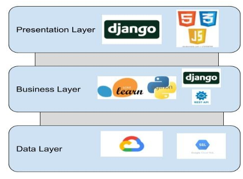
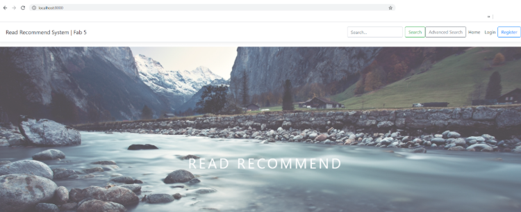
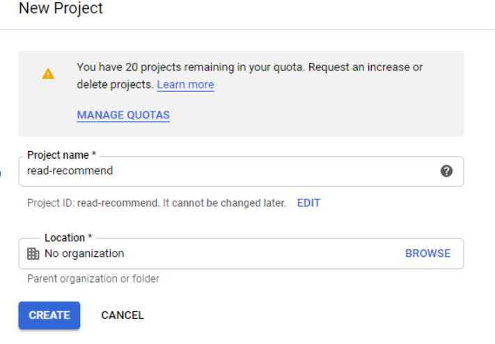

# ReadRecommend
Many people like reading, and they're often on the look-out for the next interesting book to read.
ReadRecommend is a platform that looks to provide a platform for readers to express their opinion on books they've read and liked, as well as a way to find new interesting books to read. One of the key abilities of ReadRecommend is providing readers with the ability to choose from multiple modes of recommendations.

# Project objectives
1. Able to keep track of books they have read in any collection on readers’ accounts.
2. Able to look through any collections (own or other users).
3. Able to write reviews and give ratings.
4. Able to view full details of any book including all reviews in any book collection.
5. Able to view multiple aggregate statistics, including the book's average rating when viewing full details of books.
6. Able to search for books by name, author, or mostly recently added books to readers collections.
7. Able to filter out books from search results that are under a given average rating.
8. Able to provide readers with multiple recommendation modes.

# Layer architecture

# ReadRecommend Deployment

## Local development

### Local: Create python environment
1. Download anaconda, https://www.anaconda.com/products/individual
2. Create a virtual environment
3. Download github desktop https://desktop.github.com/
4. Clone the repository
5. Open a terminal with the environment
6. Go to the repository directory
7. $ pip install -r requirements
8. $ python manage.py migrate
9. Create a folder called media in capstone-project-fab-5-test\mysite
10. $ python manage.py collectstatic
11. $ python manage.py runserver

### Local: Insert book data
1. ensure you have finish above steps, especially the migrate step.
2. download sqlite studio: https://sqlitestudio.pl/
3. add a database
4. choose dq3.sqlite file from mysite directory
5. import data from csv
6. choose ultimate_books_sqlite_utf_8.csv from data directory
7. import with utf-8

## Cloud development

### Cloud: Create a Google cloud project
1. Click the project drop down list.
2. Create a new project
3. Enter the project name and location
4. Click create button

### Cloud: Create a Database Instance
1. Go to SQL dashboard
2. Click Create Instance
3. Click MySQL
4. Write the detail of the database instance. Choose Australia-southeast1(Sydney), australia-southeast1-a. If you choose different region and zone, please make sure it is same as the vm instance.
5. Click create button
6. Configure connections, click allow only SSL connections
7. Download client-key.pem, client-cert.pem, server-ca.pem, replace the capstone directory’s old certificates.
8. Upload the three files to the vm instance if created. It will be in your home directory. Copy them into /django/capstone-project-fab-5 directory

### Cloud: Create a vm instance
1. Go to Compute Engine -> VM instances
2. Click create instance button
3. Choose Australia-southeast1 (Sydney) and Australia-southeast1-a which is same as the database instance. Check Allow HTTP traffic box.
4. Click create button
5. Go to VPC network -> External IP addresses, change type to static

### Cloud: Allow VM instance access the SQL database
1. Go to VM instances page, copy the external IP address.
2. Go to SQL, click the database instance created before
3. Go to Connections page
4. Click Add network button
5. Copy the IP address and click done
6. Click Save button
7. Go to users page, create a djangouser
8. Enter the user name as djangouser, password as readrecommend_fab5, and copy IP address to restriction IP address. Click create button.

### Cloud: Create a Google cloud database
1. Go to databases, click create database
2. Enter the name as ReadRec, click create button

### Cloud: Deploy vm instance to host Django application (easy, using setup.sh)
1. Go to VM instances, click ssh button
2. Now you can see a terminal window
3. Use root user to create /django directory
4. change to /django directory
5. copy the three SQL SSL certificates into /django directory
6. $ apt install git
7. $ git clone https://github.com/unsw-cse-capstone-project/capstone-project-fab-5.git
8. $ cd capstone-project-fab-5
9. $ bash setup.sh
10. check your website

### Cloud: Insert book data
1. Upload the csv file you want to import into the database tables into cloud storage/bucket.
2. Insert file named “final_books.csv” from the data folder in the git repository into the preferred data bucket using upload files. 
3. Switch tabs to go to the SQL Backend named “read-recommend”
4. Then click on the backend instance to go to this page.
5. Click on the import function to go to the next page. Choose the datafile named final_books.csv and type as CSV and not SQL. Type in the name of the table called “books_books”.
6. The data gets uploaded automatically after clicking import. 
